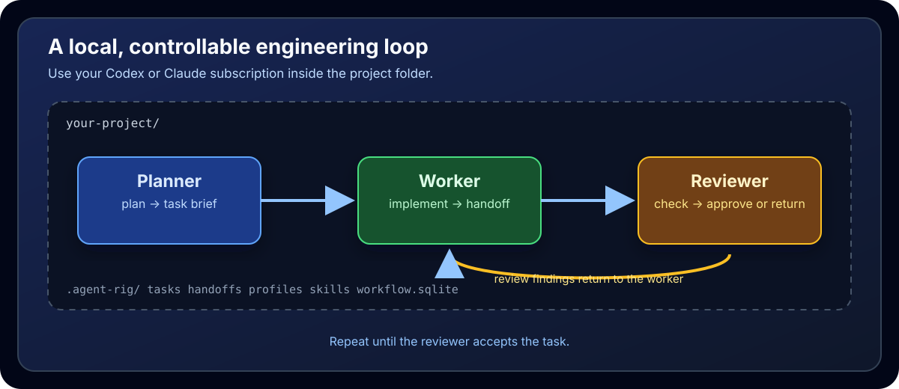

<p align="center">
  
</p>

<h1 align="center">agent-rig</h1>

<p align="center">
  Filesystem-first agent workspaces for Claude, Codex, OpenCode, and custom subscription tools.
</p>

<p align="center">
  <a href="LICENSE"></a>
  <a href="docs/project_specs.md"></a>
  
  
</p>

<p align="center">
  <a href="docs/project_specs.md">Spec</a>
  ·
  <a href="docs/profiles.md">Profiles</a>
  ·
  <a href="docs/tasks.md">Tasks</a>
  ·
  <a href="docs/phases/README.md">Implementation Phases</a>
  ·
  <a href="LICENSE">License</a>
</p>

---

## What It Is

AgentRig is a TypeScript CLI tool for scaffolding a filesystem-first agent workspace into any project.

It creates a `.agent-rig/` directory where agents, shared context, workflow records, findings notes, handoff logs, credentials, and launch instructions live. Markdown is the default workflow store. SQLite is available for larger projects and becomes the live source of truth after migration. AgentRig does not orchestrate AI APIs; users run subscription tools such as Claude, Codex, OpenCode, or custom tools directly.

The main idea is to provide a controllable and customizable engineering loop
inside the project folder. You can use your existing Codex or Claude
subscription to run the planner, worker, and reviewer workflow without moving
project coordination into a separate hosted system.

<p align="center">
  
</p>

Handoff logs are intended for cross-session resume notes when work stops midstream or a session closes after a meaningful milestone. They are not meant to duplicate normal planner, worker, or reviewer task flow, which should already live in phase docs, task files, code review notes, and task status changes.

The current MVP can scaffold a workspace, manage agents and credentials, install profile-declared skills, create fully briefed Markdown- or SQLite-backed tasks, run a Codex/OpenCode worker-reviewer loop, report live status, and serve a read-only task board.

## Core Model

AgentRig workspaces are ordinary project files:

```text
.agent-rig/
├── _shared/        # context, workflow store, profiles, notes, handoff logs
├── .creds/         # gitignored local secrets
├── <agent>/        # agent.toml, instructions.md, context, skills, tools, runs
└── human/          # human approval, unblock, and override helpers
```

The default `agent-rig init --yes` workspace is a solo `worker` agent using `codex`. Interactive setup can scaffold solo, coder-reviewer, trinity, supervisor-worker, swarm, testing-reviewer, or custom patterns.

Fresh workspaces can select SQLite directly with `agent-rig init --yes --workflow-store sqlite`. Markdown remains the default.

Agent instructions start from editable profiles in `.agent-rig/_shared/profiles/`. Built-in profiles are `planner`, `worker`, `reviewer`, `researcher`, `writer`, and `designer`; custom profiles are plain Markdown files with YAML frontmatter.

Built-in profiles are maintained as templates under `templates/profiles/`. To
start a new built-in profile in the repository, run:

```bash
npm run profile:create -- api-specialist
```

The generator creates the required metadata, standard instruction headings,
and the default shared skills. Complete the profile before building or
publishing AgentRig.

In practice, use `_shared/handoff_logs/` for session-end operational context such as current branch, active task or phase, unresolved blockers, and the exact next step. Do not add a handoff after every worker or reviewer task unless the task flow itself failed to capture something important.

Use `_shared/notes/` for short worker or reviewer findings that are worth carrying forward across sessions: reusable implementation patterns, repo quirks, recurring review findings, or out-of-norm events. Do not use it for routine progress logs.

## Dependencies

Required:

```text
node >= 20
npm or npx
```

AgentRig is packaged as an npm CLI.

## Installation

```bash
npm install -g @inotives/agent-rig
# or
pnpm add -g @inotives/agent-rig
```

Verify the CLI is available:

```bash
agent-rig --help
```

You can also run AgentRig without a global install:

```bash
npx @inotives/agent-rig --help
```

## Setup

Run AgentRig from inside the project you want to scaffold:

```bash
cd path/to/your-project
agent-rig init
```

`agent-rig init` starts a setup interview and writes a `.agent-rig/` workspace into the current project.

For the non-interactive MVP default, scaffold a solo `worker` agent using `codex`:

```bash
agent-rig init --yes
```

To start a fresh workspace with SQLite:

```bash
agent-rig init --yes --workflow-store sqlite
```

Or do the same through `npx`:

```bash
npx @inotives/agent-rig init --yes
```

After setup, validate the workspace:

```bash
agent-rig validate
agent-rig doctor
agent-rig agents
agent-rig status
```

AgentRig installs default shared skills during setup. To skip network skill installs in automation or tests:

```bash
AGENT_RIG_SKIP_SKILLS=1 agent-rig init --yes
```

Basic task flow:

```bash
agent-rig tasks create "Implement X" --body-file docs/tasks/implement-x.md --assigned-to worker --status ready --type task
agent-rig tasks
agent-rig tasks next --agent worker
agent-rig tasks next --agent worker --claim
agent-rig tasks show task-0001
agent-rig status
```

`--body-file` is required for new tasks. The brief must contain non-empty
`Context`, `Goal`, `Scope`, `Planner Notes`, and `Implementation Plan`
sections, plus at least one checklist item under `Acceptance Criteria`.
`Notes` is optional and is used for later worker and reviewer findings. Use
`agent-rig tasks update-body` to replace a task brief.

Workflow storage defaults to Markdown task and handoff records. The active
provider is configured in `.agent-rig/_shared/agent-rig.json`; agents mutate
workflow state through `agent-rig tasks ...` and never edit SQLite directly.
To make SQLite canonical, finish Markdown-backed implementation work and run:

```bash
agent-rig workflow migrate --to sqlite
```

Migration validates and verifies a new database before switching the provider,
refuses unsafe reruns, leaves `docs/` and run artifacts outside the store, and
marks the original Markdown records as historical. After migration, `tasks`,
`tasks show`, `tasks next`, `status`, and the worker-reviewer loop use SQLite;
the Markdown files remain reference material rather than dual-written live
records.

For recovery and incremental synchronization, use `workflow import --from
markdown` (locked, non-destructive, and JSON-capable), `workflow backup
[--output <path>]`, or `workflow rebuild --replace --confirm "REPLACE SQLITE"`.
Rebuild is a dry run unless explicitly confirmed; it creates a timestamped
backup and keeps SQLite records on same-ID conflicts.

In SQLite mode, `tasks done` and `tasks set-status <id> done` require a worker
handoff followed by a reviewer handoff. Manual runs can record these with
`tasks handoff`; a human can explicitly use `--admin-override` for an
exceptional completion. `tasks handoff <id> --source-file <path>` reconciles a
handoff file created just after migration and marks that file historical. A
late import keeps its original timestamp as audit metadata while its SQLite
sequence records when it joined the live conversation. `status --json` shows
`source_order_conflict` when that timestamp predates the preceding handoff;
normal completion then needs a new worker handoff and independent review.

`agent-rig status` is read-only. In Phase 15 it includes a compact `Loop:` section showing lock state, the next default `worker` or `reviewer` action, and the latest default worker/reviewer run summaries. Use `agent-rig status --json` for a top-level `loop` object with the same derived data. Detailed prompt and message artifacts stay in the local run paths under `.agent-rig/worker/runs/` and `.agent-rig/reviewer/runs/`.

Worker-reviewer flow:

```bash
# planner and human grill and finalize the phase plan first
# then split the approved plan into dependency-gated tasks
git switch -c feat/my-phase-work
# manager loop: spawn the assigned worker, then an independent reviewer
agent-rig loop
```

The planner and human first hammer out the phase and implementation details in canonical repository documents under `docs/`; those documents are not migrated into the workflow store. Only after the plan is approved are tasks created. Dependency-free foundation tasks become `ready`; downstream tasks remain `blocked`. For each selected task, the manager spawns a worker sub-agent using its AgentRig profile, waits for a worker handoff, then spawns an independent reviewer sub-agent. Review findings return the same task to the worker for fixes and re-review; only a clean review unlocks the next selected dependent task. If implementation reveals a limitation that changes the plan, pause the affected graph, return to planner/human discussion, update `docs/`, and revise tasks before continuing. A final integrated reviewer runs after all implementation tasks pass.

`agent-rig loop` is the execution engine for a configured worker/reviewer pair. It supports agents configured with `tool = "codex"` or `tool = "opencode"`, runs continuously by default, keeps branch creation and manager decisions outside the loop, and uses the existing task lifecycle:

```text
ready -> in_progress -> review -> done
                        \-> ready
                        \-> blocked
```

Use `agent-rig loop --once` for a deterministic single tick in tests or scripts. `agent-rig watch --once` still exists for the older filesystem-only single-task adapter.

OpenCode loop runs use the OpenCode default model configured in the user's environment. AgentRig does not pass OpenCode `--model` or `--auto`. Claude loop execution is still unsupported.

Live OpenCode smoke testing remains a manual verification step and is not part of automated CI.

## Local Task Board UI

Start the read-only task board from the project whose workflow state you want
to inspect:

```bash
agent-rig ui
# open http://127.0.0.1:8787 in a browser
```

The UI binds to localhost only and uses port `8787` by default. Select another
port with `agent-rig ui --port 9000`; the command prints the listening URL and
does not open a browser automatically. The board reads the active workflow
provider and never mutates tasks or handoffs. Use the `agent-rig tasks ...`
commands for all workflow changes.

The single-page board filters tasks by phase and status, opens task details in
a side panel, shows handoffs in a searchable timeline, and opens handoff
details in a modal. It supports light and dark themes and preserves the
selected phase during browser refresh.

The frontend is packaged as static assets. From a repository checkout,
`npm run build` compiles TypeScript and then runs Tailwind to generate
`dist/ui.css`, copies `src/ui/core/ui.html` to `dist/index.html`, and emits the
frontend bundle used by the server. Run `npm install` before the first build so
the local Tailwind executable is available; installed packages serve the
already-built assets and do not build frontend dependencies at runtime.

## Common Commands

| Command | Purpose |
|---|---|
| `agent-rig init` | Run the setup-pattern interview and scaffold `.agent-rig/`. |
| `agent-rig init --yes` | Scaffold a solo `worker` using `codex` with Markdown storage. |
| `agent-rig init --yes --workflow-store sqlite` | Scaffold a solo `worker` with a fresh SQLite workflow store. |
| `agent-rig add <agent-name>` | Add an agent to an existing workspace. |
| `agent-rig add <agent-name> --profile worker` | Add an agent from an editable profile. |
| `agent-rig profiles` | List available agent profiles. |
| `agent-rig profiles show worker` | Print a profile Markdown template. |
| `agent-rig profiles update worker --agent worker` | Preview a built-in profile update for one deployed agent. |
| `agent-rig profiles update worker --all --apply` | Apply a built-in profile update to all matching agents and create backups. |
| `npm run profile:create -- designer` | Create a partial built-in profile template in `templates/profiles/`. |
| `agent-rig doctor` | Check local AgentRig environment and workspace health. |
| `agent-rig agents` | List configured agents and tools. |
| `agent-rig validate` | Validate workspace files without mutating them. |
| `agent-rig ui` | Serve the read-only local task board at `127.0.0.1:8787`. |
| `agent-rig ui --port <port>` | Serve the read-only local task board on a custom port. |
| `agent-rig creds` | Create credential placeholders and `.env.example` files. |
| `agent-rig skills` | Install and list shared or agent-local skills. |
| `agent-rig status` | Show live session state, task counts, loop observability, and recent handoffs. |
| `agent-rig start --agent <agent-name>` | Print launch guidance plus relevant resume context for a configured agent. |
| `agent-rig tasks create "<title>" --body-file <path>` | Create a fully briefed task in the active store. |
| `agent-rig tasks update-body <task-id> --body-file <path>` | Replace a task brief through the active store. |
| `agent-rig tasks` | List shared tasks. |
| `agent-rig tasks show <task-id>` | Print the canonical task Markdown. |
| `agent-rig tasks next --agent <agent-name>` | Print the next dependency-ready shared task for an agent. |
| `agent-rig tasks next --agent <agent-name> --claim` | Mark the next dependency-ready shared task as `in_progress`. |
| `agent-rig tasks set-status <task-id> <status>` | Update task lifecycle status. |
| `agent-rig tasks assign <task-id> <agent-name>` | Assign a shared task to an agent. |
| `agent-rig tasks block <task-id> --reason <reason>` | Mark a task blocked and record the blocker. |
| `agent-rig tasks done <task-id>` | Mark a task done. |
| `agent-rig tasks handoff <task-id> ...` | Record a manual handoff in the active store. |
| `agent-rig workflow migrate --to sqlite` | Validate and migrate the Markdown workflow store to SQLite. |
| `agent-rig workflow import --from markdown` | Import new unmarked Markdown records without overwriting SQLite. |
| `agent-rig workflow backup [--output <path>]` | Create and validate a consistent read-only SQLite snapshot. |
| `agent-rig workflow rebuild [--replace --confirm "REPLACE SQLITE"]` | Preview or guardedly rebuild SQLite from Markdown. |
| `agent-rig loop` | Run the Codex/OpenCode worker-reviewer loop continuously. |
| `agent-rig loop --once` | Run one Codex/OpenCode worker-reviewer loop tick and exit. |
| `agent-rig watch --once` | Process one ready shared task and exit. |

## Implementation Phases

The current implementation history is split into completed archived phases plus
the capability-based structure work from Phase 20:

```text
1. CLI scaffold
2. Workspace model and validation
3. Credentials and agent management
4. Live state and launch
5. First MVP watch loop
6. Pre-release and npm registry preparation
...
13. Worker-reviewer loop
14. OpenCode loop adapter
15. Loop observability
16. Pluggable workflow storage
17. Task board UI
18. SPA task board UI
19. DaisyUI task board refresh
20. Capability-based source structure
```

See [docs/phases](docs/phases/).

## Development

Run the local checks:

```bash
npm run build
npm test
npm --cache /tmp/agent-rig-npm-cache pack --dry-run
```

`npm run build` is required when changing the UI source or packaging a release:
it runs `tsc` and the Tailwind/DaisyUI static-asset build in
`scripts/build-ui.mjs`.

For future phases, follow the planning and manager workflow in [AGENTS.md](AGENTS.md): grill with the human, finalize the plan, create dependency-gated tasks, and drive each task through an independent worker/reviewer handoff loop.

## Repository Layout

```text
agent-rig/
├── docs/
│   ├── project_specs.md
│   ├── profiles.md
│   ├── _archived/
│   └── phases/
├── src/
│   ├── cli/
│   ├── workspace/
│   ├── profiles/
│   ├── workflow/
│   └── ui/
│       ├── core/               # routing, server, API, contracts, config
│       ├── common/             # shared UI components and helpers
│       └── pages/task-board/   # task board page and task detail behavior
├── templates/
├── test/
│   ├── ui/
│   └── integration/
├── AGENTS.md
├── README.md
└── LICENSE
```

## License

Apache License 2.0. See [LICENSE](LICENSE).
